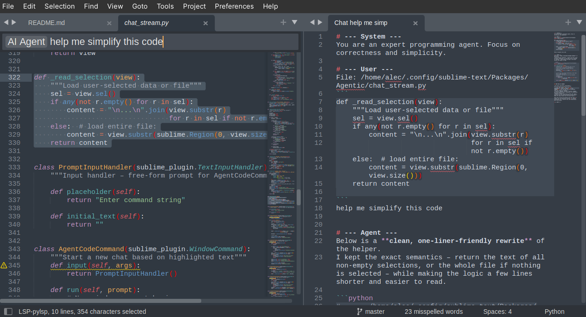
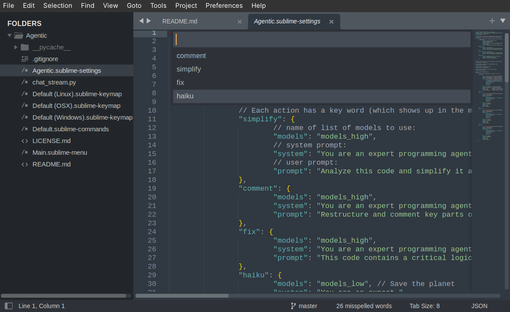
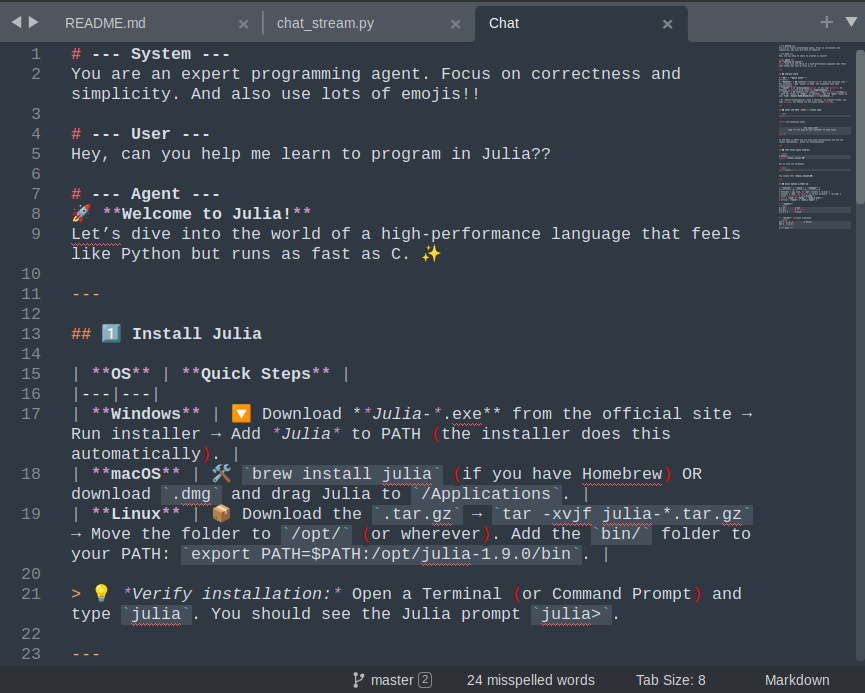

# Agentic – LLM Agents for Sublime Text 🤖
A lightweight [Sublime Text](https://www.sublimetext.com/) plugin that lets you concurrently command multiple local or remote LLMs.

## Introduction 🖊
```
Sublime breathes code,
Agents speak in marked whispers,
Chats rise, fall, then rest.
```
*~llama.cpp GPT-OSS-20b on Agentic/chat_stream.py using the "haiku" action*

This plugin lets you run models over OpenAI-style chat completion APIs, tested to work with [llama.cpp](https://github.com/ggml-org/llama.cpp), [groq accelerators](https://console.groq.com/docs/api-reference#chat-create), [Google Gemini (TPU)](https://ai.google.dev/gemini-api/docs/openai), and the [OpenAI official API](https://platform.openai.com/docs/api-reference/chat). You can use this plugin to quickly send code snippets or entire files to an LLM and stream results directly back to Sublime Text. Chatting is supported through a simple markdown text file interface with hotkeys (`[ctrl/cmd]+[enter]`, `[esc]/[c]`). There is also support to easily build custom agent actions that you can quickly access from the command palette.

## Features 😍
**Highlight code and use `AI Agent` to launch a custom chat with relevant context:**


**Define and quickly launch custom actions on code sections or whole files with `AI Agent Actions`:**


**Fast and streamlined interactive markdown chat interface with fully editable history and prompts:**


## Usage 🛠
This plugin currently has four major command palette actions:
- `AI Agent` - takes highlighted text (or an entire file) and a command string to perform a custom action
- `AI Agent Action` - takes highlighted text (or an entire file) and starts a new chat based on a user-defined action (see `Agentic.sublime-settings`)
- `AI Agent Model Chat` - takes highlighted text and starts a new chat session with the selected model
- `AI Agent Chat Submit` - will send the contents of a chat file to an LLM for a chat-like interface (triggered with `[ctrl/cmd]+[enter]` from a chat file; `[c]` or `[esc]` to interrupt)

There are also several supplemental palette actions to help control chats
- `AI Agent Clear Reasoning` - deletes model 'reasoning' output from chat files
- `AI Agent Clone Chat` - creates a copy of an existing chat
- `AI Agent New Chat` - creates a new chat file

For settings, there is a convenience command:
- `AI Agent Settings` which will open your configuration file `Agentic.sublime-settings`.

## Settings ✏
### Model Configuration
Configuring models is done through `AI Agent Settings` -> modify `Agentic.sublime-settings`:

**(Example model configuration for local llama.cpp running OpenAI GPT-OSS-120B:)**
```json
"models_high": ["local-20b-high1", "local-20b-high2"],
"models": {
		"local-20b-high1":
		{
			"url": "http://127.0.0.1:8080/v1/chat/completions",
			"model": "gpt-oss-20b",
			"token": "000000000000",
			"options": {
				"stream": true,
				"chat_template_kwargs": {"reasoning_effort": "high"},
				"temperature": 1.0,
				"top_p": 1.0,
				"min_p": 0,
				"top_k": 0
			},
			"context": 128000.0,
			"system": "my_gpu1",
			"workers": 3,
			"speed": 120,
			"effort": 32768.0,
			"cost": 0.056,
		},
		"local-20b-high2":
		...
}
```
* Models are organized through a list of model names in the settings (`"models_high": [...]`)
* Each model has a name (`"high_1"`, `"high_1"`, `"my-model"`, etc.)
* The `"model"` name should match what the API provider requres (example below)
* Include a token for paid APIs
* Any additional model API parameters are placed in `"options"`
* `"context"` = Approximate usable context length
* `"system"` = A unique resource id (for local systems)
* `"workers"` = Number of concurrent requests supported on the system
* `"speed"` = Approximate tokens per second
* `"effort"` = Typical number of tokens used to solve an average problem
* `"cost"` = $ USD per million generated tokens (electricity cost for local GPT-OSS-20B)

**Common Model Configuration Errors** (will display if you try to run and `AI Agent` command with an invalid configuration):
* `HTTP Error 400: Bad Request` - bad `"options"` for the model
* `HTTP Error 401: Unauthorized` - bad authentication token
* `HTTP Error 404: Not Found` - invalid `"model"` name or bad URL
* `urlopen error [Errno -2] Name or service not known` - bad URL

Configuring user-defined actions (`AI Agent Settings` / `Agentic.sublime-settings`):

**Example [groq (LPU)](https://groq.com/) GPT-OSS-120B:** 🚀
```json
"groq-oss-120":{
	"url":"https://api.groq.com/openai/v1/chat/completions",
	"model": "openai/gpt-oss-120b",
	"token": "<YOUR_GROQ_API_KEY>",
	"options": {
		"stream": true,
		"reasoning_effort": "high",
		"temperature": 1,
		"top_p": 1,
		"presence_penalty": 0.5,
	},
	"context": 131072,
	"system": "groq",
	"workers": 1000.0,
	"speed": 500.0,
	"effort": 32768.0,
	"cost": 0.75
},
```

**Example [groq compound (mini)](https://console.groq.com/docs/compound) 📚**
```json
"groq-compound-mini":{
	"url":"https://api.groq.com/openai/v1/chat/completions",
	"model": "groq/compound-mini",
	"token": "<YOUR_GROQ_API_KEY>",
	"options": {
		"stream": true,
		"temperature": 1,
		"top_p": 1,
		"max_completion_tokens": 1024,
		"compound_custom":{"tools":{"enabled_tools":
			["code_interpreter","web_search","visit_website"]}}
	},
	"context": 131072,
	"system": "groq",
	"workers": 1000.0,
	"speed": 450.0,
	"effort": 32768.0,
	"cost": 0.75,
},
```
* ^ This model is integrated with tools, enabling web search ([Tavily](https://www.tavily.com/)), single-page website download, and sandboxed cloud code evaluation, streamed directly back into Sublime Text. Raw results from these actions are output as 'reasoning' tokens.

**Example Model configuration - Google (TPU) Gemini 2.5 Pro:** 🏋
```JSON
"gemini-2.5-pro": {
	"url":"https://generativelanguage.googleapis.com/v1beta/openai/chat/completions",
	"model": "gemini-2.5-pro",
	"token": "<YOUR_GOOGLE_API_KEY>",
	"options": {
		"stream": true,
		"reasoning_effort": "high"
	},
	"context": 1050000,
	"system": "google",
	"workers": 1000.0,
	"speed": 79.94,
	"effort": 24576.0,
	"cost": 11.25,
},
```

**Example Model configuration - OpenAI GPT-5:** 🐢
```JSON
"gpt-5":{
	"url":"https://api.openai.com/v1/chat/completions",
	"model": "gpt-5",
	"token": "<YOUR_OPENAI_API_KEY>",
	"options": {
		"stream": false,
		"reasoning_effort": "high",
		"verbosity": "low"
	},
	"context": 400000,
	"system": "openai",
	"workers": 1000.0,
	"speed": 40.0,
	"effort": 4096.0,
	"cost": 11.25
},
```
- ^ Note, for `gpt-5` and `gpt-5-mini`, `"stream": true` does not work unless you verify your ID. `gpt-5-nano` streaming always works though.

### Customizing user actions
**Example "haiku" action:**
```json
"actions": {
		"haiku": {
			"models": "models_high",
			"system": "You are an expert.",
			"prompt": "Turn this into a haiku."
		},
		...
}
```
* Each action has a key word (which shows up in the menu):
* `"models"` should be the name of list of models to use (see model configuration)
* `"system"` is the system prompt to use for the action
* `"prompt"` is the user prompt to use for the action

## Installation 📂
You can install this plugin by saving it in your `Packages` folder:
```cmd
cd "%APPDATA%\Sublime Text\Packages"                      # on Windows
cd ~/Library/Application\ Support/Sublime\ Text/Packages  # on Mac
cd ~/.config/sublime-text/Packages                        # on Linux

git clone https://git.sr.ht/~alecgraves/Agentic
```

* This plugin works well with [Origami](https://github.com/SublimeText/Origami)
    * `"auto_close_empty_panes": true`
    * Better pane navigation from the keyboard

## Status ✅
Currently, this plugin supports chat incorporating user-highlighted code for context. This functionality has been tested with local LLMs running under [llama.cpp](https://github.com/ggml-org/llama.cpp). Future goals include implementation of DeepMind AlphaEvolve-like functionality for automated high-performance evolutionary code optimization.

- [x] Sublime chat interface
- [x] Submit query with context
- [x] User-defined chat actions
- [x] Multiple local LLM support
- [x] Accelerator APIs ([groq](https://groq.com/), [Google TPU](https://cloud.google.com/blog/products/compute/inside-the-ironwood-tpu-codesigned-ai-stack))
- [ ] Function calling
- [ ] Multi-agent workflows (e.g. generate then reduce/combine)

## License ⚖
This project is released under 🔥 ⚖ The Unlicense ⚖ 🔥

## Appendix: Local LLM Model Installation and Running 🚀

`Agentic` uses the OpenAI API, so anything that supports it should work. Ollama and llama.cpp are popular programs to run local LLMs. llama.cpp is faster, so this guide covers its use.

Cloud LLM providers will receive any data you choose to send them through `AI Agent` commands, cloud server compute availability can fluctuate, and cloud-hosted model behavior can change suddenly. Due to these problems, it is often better to rely on open-weight local/on-premise models. Many good models like GPT-OSS-20B will run with >90k tokens (~360k characters) of context on a 16 GB graphics card such as the AMD RX 9060 or Nvidia 5060 TI at >50 tk/s or two 8 GB graphics cards like the Nvidia T1000 at >25 tk/s. Larger models like GPT-OSS-120B can run on a modern CPU system with 128 GB of RAM at 20tk/s. Using these options can improve developer productivity and significantly reduce operating costs for running LLMs (e.g. GPT-OSS-20B is $0.05/mil tokens electricity cost running on a 200W local GPU, while the roughly equivalent GPT-5-nano is $0.45/mil tokens: 9x more expensive).

### 1. Build llama.cpp (updated 2025)
To install [llama.cpp](https://github.com/ggml-org/llama.cpp), compile it for your platform. The llama-server file is located at `build/bin/llama-server`

NVIDIA (`Makefile`):
```make
CC=clang
CXX=clang++
LLD=lld

LDLINKFLAGS=-flto -Wl,--gc-sections -Wl,-pie
LIBCFLAGS=-fstack-protector-all -D_FORTIFY_SOURCE=3 -ffunction-sections \
	-fdata-sections -fvisibility-inlines-hidden -O2 \
	-march=native -mtune=native \
	-funsafe-math-optimizations -ffast-math -fno-finite-math-only -flto -fpic

all:
	cmake -B build -DGGML_CUDA=ON -DGGML_CUDA_FA_ALL_QUANTS=true \
		-DGGML_CUDA_F16=true -DBUILD_SHARED_LIBS=OFF -DCMAKE_BUILD_TYPE=MinSizeRel \
		-DBUILD_TESTING=OFF -DCMAKE_C_COMPILER=$(CC) -DCMAKE_CXX_COMPILER=$(CXX) \
		-DCMAKE_LINKER="$(LLD)" -DCMAKE_C_FLAGS="$(LIBCFLAGS)" -DCMAKE_CXX_FLAGS="$(LIBCFLAGS)" \
		-DCMAKE_C_FLAGS_MINSIZEREL="$(LIBCFLAGS)" -DCMAKE_CXX_FLAGS_MINSIZEREL="$(LIBCFLAGS)" \
		-DCMAKE_EXE_LINKER_FLAGS="$(LDLINKFLAGS)"
	LDLINKFLAGS="$(LDLINKFLAGS)" make -C build -j $$(nproc) llama-server
```

NVIDIA + Intel-CPU (ICX compiler) (`sh`):
```sh
{ . /opt/intel/oneapi/setvars.sh --force; } || { echo Already sourced...; }
git fetch --prune
git pull
cmake -B build -DGGML_CUDA=ON -DLLAMA_CURL=OFF -DBUILD_SHARED_LIBS=OFF  \
	-DCMAKE_POSITION_INDEPENDENT_CODE=1 -DGGML_CUDA_F16=1 -DGGML_CUDA_FA_ALL_QUANTS=1 \
	-DCMAKE_BUILD_TYPE=Release \
	-DCMAKE_CXX_FLAGS_RELEASE="-fPIE -march=native -mtune=native -ffunction-sections -fdata-sections -flto -fstack-protector-all -D_FORTIFY_SOURCE=3 -mshstk -fcf-protection=full -Wl,--gc-sections,-flto" \
	-DCMAKE_C_FLAGS_RELEASE="-fPIE -ffunction-sections -fdata-sections -flto -fstack-protector-all -D_FORTIFY_SOURCE=3 -mshstk -fcf-protection=full -march=native -mtune=native -Wl,--gc-sections,-flto" \
	-DGGML_BLAS=ON -DCMAKE_C_COMPILER=icx -DCMAKE_CXX_COMPILER=icpx -DGGML_NATIVE=ON
make -C build -j $(nproc) llama-server
```

AMDGPU (ROCm) (`sh`):
```sh
HIPCXX="$(hipconfig -l)/clang" HIP_PATH="$(hipconfig -R)" \
    cmake -S . -B build -DGGML_HIP=ON -DLLAMA_CURL=OFF -DAMDGPU_TARGETS=gfx1200 -DCMAKE_BUILD_TYPE=Release \
    && make -C build -j $(nproc) llama-server
```

### 2. Download a good LLM
Download a good model like [Qwen-30b-A3b **IQ4-NL**](https://huggingface.co/unsloth/Qwen3-30B-A3B-Thinking-2507-GGUF) or [GPT-OSS-20b **F16**](https://huggingface.co/unsloth/gpt-oss-20b-GGUF).

### 3. Run llama.cpp with your LLM
Then, run llama-server:

- OSS 20B, 24GB vram, NVidia:
```sh
CUDA_VISIBLE_DEVICES=0 llama-server -m ~/models/gpt-oss-20b-F16.gguf -ctk f16 -ctv f16 -np 3 -fa on -c $((32768*4*3)) --top-k 0 --temp 1.0 --top-p 1.0  --min-p 0 --presence-penalty 0.5 --jinja -ngl 20000 --prio 3 --port 8080 --no-mmap --chat-template-kwargs '{\"reasoning_effort\": \"high\"}'
```

- OSS 20B, 16GB vram, AMD ROCm:
```sh
HIP_VISIBLE_DEVICES=0 llama-server -m ~/models/gpt-oss-20b-F16.gguf -ctk f16 -ctv f16 -fa on -ngl 100 -c $((32768*3)) -np 1 --jinja --port 8080 --chat-template-kwargs '{\"reasoning_effort\": \"high\"}'
```

- OSS 20B, 2xT1000 8GB:
```sh
llama-server -ngl 99 -c $((32768*2)) -t 4 -fa on -ctk f16 -ctv f16 -m ~/models/gpt-oss-20b-F16.gguf --jinja  --prio 3 --top-k 0 --temp 1.0 --top-p 1.0 --min-p 0 --presence-penalty 0.5 -np 1 --port 8080 --split-mode row --tensor-split 7,8 --chat-template-kwargs '{\"reasoning_effort\": \"high\"}'
```

- OSS 120B (Intel CPU, 64GB RAM):
```sh
CUDA_VISIBLE_DEVICES='' llama-server -fa on -ctk q8_0 -ctv q8_0 -m ~/models/gpt-oss-120b-UD-Q4_K_XL-00001*.gguf -np 1 --n-gpu-layers 99 -c $((32768*2)) --top-k 0 --temp 1.0 --top-p 1.0 --jinja  --min-p 0 --presence-penalty 0.5 -n 38912 --prio 2 --port 8081 --mlock --swa-full --chat-template-kwargs '{\"reasoning_effort\": \"high\"}'
```

### 4. Connect
Now you should be able to automatically connect and run Agent commands, or you can update your model configurations to match your local deployment.

run the `AI Agent Settings` command, or go to `Preferences > Package Settings > Agentic > Settings` to modify your llm configuration to point to your local server. You can use port tunneling (`ssh -L ...`) to securely connect to personal LLM servers as well.
